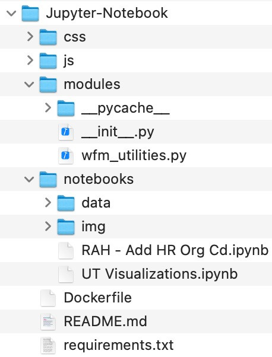
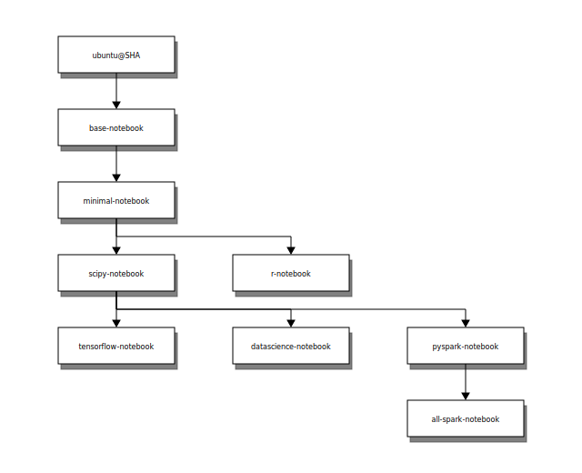
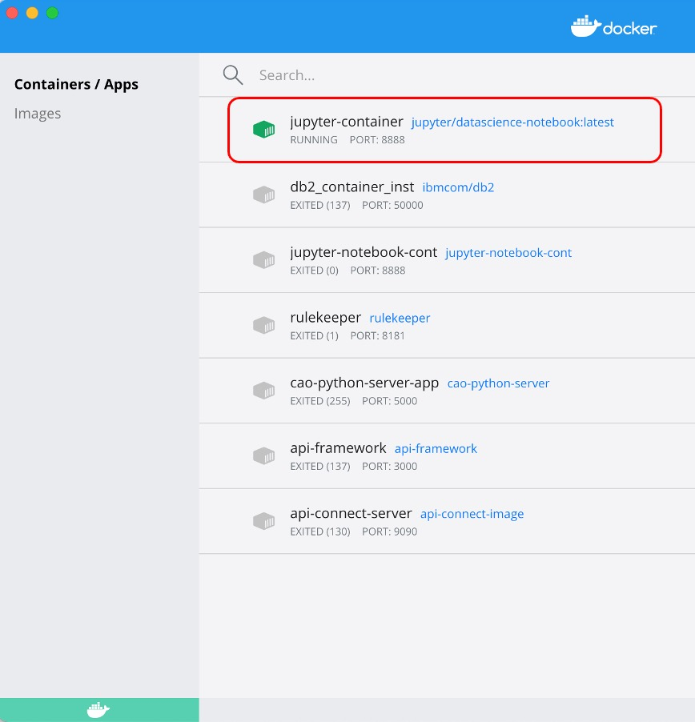
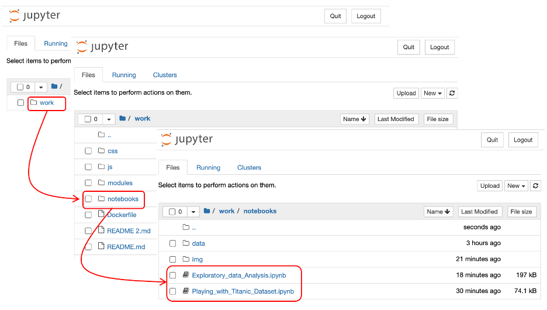

# Containerizing Jupyter Notebooks

**Table of contents**

1. [Introduction](#1.0)
1. [Pre-requisites](#2.0)
1. [Directory Structure](#3.0)
    1. [modules directory](#3.1)
    1. [notebooks directory](#3.2)
    1. [css and js directories](#3.3)
    1. [Other files](#3.4)
1. [Jupyter Docker Images](#4.0)
1. [Run Jupyter Notebook locally in a container](#5.0)
1. [Persisting changes from the container](#6.0)
1. [Running the Notebook](#7.0)

<a id="1.0"></a>

## Introduction
This repository is a simple example of packaging Jupyter Notebooks and its required environment in a container to allow users to run them locally (without having a Python/Jupyter environment installed).

Jupyter Notebooks are an open-source tool that enable data analysts and scientists to create documents that integrate executable codes, widgets, modules, formulas, and visualizations. Along with these features, Jupyter Notebooks allows for the addition of textual narratives. These narratives explain the content in a way that the document itself tells a comprehensive story. With Jupyter supporting over 40 programming languages, including Python, R, Julia, and Scala, task specific packages can be easily included in each notebook to support data acquisition, cleansing and normalization, analysis, visualization, and machine learning. With its impressive set of capabilities, Jupyter Notebooks have become ubiquitous within the data science community, but not beyond that. Why? As great as Jupyter is, it can be burdensome when it comes to sharing your work and collaborating with executives and non-data scientists.  Although Jupyter notebooks allow you to interactively experiment with different scenarios and/or present a story and allows business professionals to change pieces of the narrative to see what happens, it requires some degree of setup. Unfortunately, this setup bars many business professionals and executives from using them.

Containerization provides a way to deliver the analysis benefits of notebooks to non-technical audiences leaving the setup with the developer of the core code. Docker containers are an excellent way to package up an analysis. They can include the data you need, any scripts and code, and they’re guaranteed to work on everyone’s machine—no installation required.

Docker is a set of platform-as-a-service products that uses OS-level virtualization to deliver software in packages called containers. Containers are isolated from one another and bundle their own software, libraries and configuration files; they can communicate with each other through well-defined channels.

Docker uses a special ‘Dockerfile’ that describes all steps to build an image of that environment. You can then deploy that image to a Docker ‘container’, which is like a virtual computer than runs on your machine or in the cloud.

To get access to Jupyter Notebooks (or any of the many programming environments, servers, or databases that have been ‘dockerized’), we just need a Dockerfile. Jupyter has put together a collection of Dockerfiles for a variety of Jupyter notebooks and published them on Dockerhub.  This post will look at running Jupyter locally, using the DOCKER RUN command, and mounting a local directory as the source of the Jupyter Notebook. A prerequisite is that the user has Docker Desktop installed and running.

<a id="2.0"></a>

---
## Pre-requisites    
If you’re using Windows or Mac, you can install Docker Desktop, or if you’re using a Linux system you can install Docker using your package manager. You can find the instructions for your operating system at [Docker’s installation site](https://docs.docker.com/install).

<a id="3.0"></a>

---
## Directory Structure    
Before we begin, go over the directory structure.



<a id="3.1"></a>

### modules directory  
The `modules` directory is where the main Python (`*.py`) modules (code) are stored. These files do the heavy lifting and it’s what the developers spent all their time developing. This directory contains the `__init__.py` that is required to make Python treat the directory as a package. This prevents directories with a common name, such as string, unintentionally hiding valid modules that may occur later on the module search path.

<a id="3.2"></a>

### notebooks directory
The `notebooks` directory contains the Python Notebooks (`*.ipynb`) with the analysis and visualization that you want to be runnable for an audience who want to poke around. This directory also contains whatever raw data that may be required in the data folder and any images in the img directory.

<a id="3.3"></a>

### css and js directories
The `css` and `js` directories contain cascading stylesheets and JavaScript libraries, respectively, that may be used. Although Jupyter Notebooks do not natively support JavaScript, you can import Javascript into the environment and use it. This solution does just that, importing the d3, Data Driven Documents, libraries and uses it to build D3 dynamic trees from dataframes constructed in the notebook.

<a id="3.4"></a>

### Other files
**requirements.txt** is a fil containing a list of items to be installed using `pip` install. **pip** is the standard package manager for Python. It allows you to install and manage additional packages that are not part of the Python standard library.

**Dockerfile** is the file used to build and run the container either locally (Docker desktop) or in the cloud.

<a id="4.0"></a>
---

## Jupyter Docker Images
The diagram below shows the various Jupyter Notebook Docker images:



The Jupyter team maintains a set of Docker image definitions in this [GitHub repository](https://github.com/jupyter/docker-stacks). See [https://jupyter-docker-stacks.readthedocs.io/en/latest/using/selecting.html](https://jupyter-docker-stacks.readthedocs.io/en/latest/using/selecting.html) for additional details.

The code included in this post will use the `jupyter/scipy-notebook` image which includes popular packages from the scientific Python ecosystem.
- Everything in jupyter/minimal-notebook and its ancestor images
- dask, pandas, numexpr, matplotlib, scipy, seaborn, scikit-learn, scikit-image, sympy, cython, patsy, statsmodel, cloudpickle, dill, numba, bokeh, sqlalchemy, hdf5, vincent, beautifulsoup, protobuf, xlrd, bottleneck, and pytables packages
- ipywidgets and ipympl for interactive visualizations and plots in Python notebooks
- Facets for visualizing machine learning datasets

<a id="5.0"></a>
---

## Run Jupyter Notebook locally in a container
Once you have Docker Desktop on your computer, you can pull the image for the Jupyter notebook environment that you prefer by using the command line tool. Open your terminal to build the data science environment that will allow us to run code in Python, Julia, or R.
First, we’ll download the files required to build the image with the following command:
```
  docker pull jupyter/datascience-notebook:latest
```
The Jupyter Docker image jupyter/datascience-notebook being used is functionally robust (i.e., contains a lot of data science packages) and therefore the image size is larger. If you need less functions and packages you can use an image up the stack.

Then we can build our environment and deploy it to a Docker container with:

```
  docker run -d -p 8888:8888 --name jupyter-container --env JUPYTER_TOKEN=jupyter_notebook_token --volume ~/github/Containerizing-Jupyter-Notebooks/:/home/jovyan/work jupyter/datascience-notebook:latest
```


To make things easier, we have set an environment variable, with the `–env` flag, for the token Jupyter notebooks should use for login. We’ll use this later. Also, because we’re specifying the token ourselves, we don’t need to see the console output (to copy and paste the token), so we also add the `-d` flag to run the container in detached mode in the background. To see the output from the container, we can just use docker logs jupyter-container or just look at the logs in Docker Desktop.

We are using the `-p` flag to tell docker to connect port 8888 of the computer to port 8888 on the container. This allows us to connect to the Jupyter notebook server inside the container. We also use the `–name` flag to give us a convenient name for referring to this container in later commands. After you run this command, you can check the status of the running container through the Docker Desktop’s Dashboard.



<a id="6.0"></a>
---

## Persisting changes from the container

The **volume** command mounts a working (local) folder as a volume in our container to hold new or existing notebooks as we’re working on them. This lets us read and save our notebooks locally, while still being able to access them in our container. Using the `--volume` parameter, this example mounts the local Jupyter Notebook folder (downloaded from GitHub, `~/Containerizing-Jupyter-Notebooks`) to the default notebook location (`/home/jovyan/work`).

`-v` or `--volume` consists of three fields, separated by colon characters (:). The fields must be in the correct order, and the meaning of each field is not immediately obvious.

1.	The first field is the source directory on the local machine. In the case of named volumes, the first field is the name of the volume, and is unique on a given host machine. For anonymous volumes, the first field is omitted.
2.	The second field is the path where the file or directory are mounted in the container.
3.	The third field is optional, and is a comma-separated list of options, such as ro (read-only).

<a id="7.0"></a>
---

## Running the Notebook
Now we can log into Jupyter notebook with the token we specified in our environment variable:

```
  http://localhost:8888/?token=jupyter_notebook_token
```

This will open the notebook interface to the default directory, where the user can go into whichever Notebook they need.

> Note the `?token=jupyter_notebook_token`, this was set when we ran executed the `DOCKER run` command and set the environment variable (`--env JUPYTER_TOKEN=jupyter_notebook_token`). If this was omitted and you went to regular `http://localhost:8888/` and would need the token that is in the container output and enter it in the Notebook password screen.

That’s it. At this point you should have an up and running Jupyter Notebook environment.



